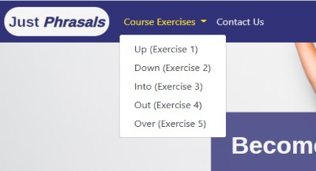

<h1 align="center"><strong>Just Phrasals Website</strong></h1>

[View live project here]()

The Just Phrasals website is a platform designed for the learning and practice of phrasal verbs, one of the most difficult parts of the language for many English language learners. Phrasal verbs are verb expressions made up of a verb + preposition(s), where the meaning is not always clear as it can often be idiomatic.

For example, most language learners will understand “look”, but not verbs like “look over”, “look up to” or “look down on”, they will be familiar with “run”, but not “run into” or “run out of”; they will now “give”, but not “give up”, “give out” or “give into”.

There are 1000s of phrasal verbs and learners will never learn and use them all unless they develop native-level mastery of English. But the Just Phrasals website is designed to be a fun and interactive way to learn some of the most common phrasal verbs, where the user is introduced to the verbs and then undertakes an exercise to practice and assimilate the verbs learned in the lessons.

The format of the website takes the style of a traditional language-learning workbook, but made more dynamic thanks to interactive elements made available through a digital platform, including audio, interactive quizzes, instant feedback on answers submitted and other elements to click and toggle. This first version of the Just Phrasals website is designed to be a “bite-size”, “free sample course”, after which the users are prompted to Sign Up for the full course for a reasonable fee. (Design of the full course was beyond the scope of this project, but the elements and process to sign up for said course have been included to demonstrate functionality of that process).

## **UX**

### <u>**User Stories**</u>

After extensive evaluation of the profiles of English language learners in our modern digital world, the website was created for the the following user profiles:

- #### Intermediate/Advanced English-language learners

As phrasal verbs are generally considered elements beyond the level of beginners, the website has been designed for intermediate and advanced English learners who already have a decent grasp of the language. With this in mind, the developer has tailored the level of language, verbs and exercises in the website for these intermediate/advanced learners.

Although that is by no means to say that high-level beginners cannot learn phrasal verbs and there are plenty of useful, basic phrasal verbs that a beginner can “pick up”. The developer of this project has considered that later versions of this free Just Phrasals course could be broken into six separate sections for Beginner (1 & 2), Intermediate (1 & 2), and Advanced (1 & 2), where users work their way up through the levels like a video game. This would provide for a more complete and lengthy experience before users eventually commit to signing up for the full paid course(s). However, that is beyond the scope of this current project, which currently includes one intermediate-level “bite-size”, “free-sample” course, broken into five exercises to complete (more on that in the XXX section).

- #### Adult learners of English

The Just Phrasals website is mainly aimed at adults and older students (from around 18 upwards) is that is reflected in the design, styling, tone and content language used, images used, exercise content and overall nature of the site.

- #### Learners from around the globe

With English being the lingua franca for the world of business, travel, politics, (not to mention TV series and films), the global market of adult English language learners around the world is huge -- from European countries like Spain, Italy and France, to Latin America, Middle East and Asia, as well as expats living in English-speaking countries like the US, the UK,

Ireland and Australia. For many, learning English is essential for their job or social life, and the Just Phrasals website is designed to help them with a very particular aspect of the language that many struggle with. And in that sense, as a standalone, dynamic, interactive phrasal verb-focused website, it is a first of its kind.

The website is designed to be generally accessible for all English language learners around the globe no matter what their native tongue is. The developer, though, is acutely aware of the fact that the website could be made more appealing and accessible if it had different versions focused on learners from different regions. It was beyond the scope of this project, but later versions of the website (both the free course(s) and eventual paid full course(s)) could include a dropdown menu where users could choose their native language. From there parts of exercises, explanations, definitions, etc. could be included in their chosen native language, for example Spanish, French, Mandarin, etc. depending on their native language chosen.

- #### Digital-savvy language learner Users

Outside the classroom, the traditional manner to learn English was in a book, particularly workbooks where the user would “pencil in” the answers to exercises. But like in many other segments and industries, print media is dying and digital-savvy users with shorter attention spans need more fun, dynamic and interactive ways to learn languages than from a printed book. This fact can be attributed to the success of language learning apps like Lingo Bongo.

Just Phrasals has been designed with the user profile of this digital-savvy English-language learner in mind. Exercises are short, text is not heavy and dense, interactive elements, like clickable buttons, interactive quizzes and other features are included to keep the user’s attention and interest. For example, each phrasal verb definition/examples are hidden behind the “verb boxes”.

But users can toggle click to show/hide these definitions/examples, which is a nice feature that demands interactivity from the user, while also ensuring the user is not bombarded with dense text on first glance (more on this can and other features will be explained in more detail in the Feature section).

### <u>**User Goals**</u>

- ####  First Time Visitor Goals

  - a) As a First Time Visitor, I want to easily understand the main purpose of the website and quickly understand its structure.
  - b) As a First Time Visitor, I want to easily navigate the website to begin the free course.
  - c) As a First Time Visitor, I want to immediately sign up for the full paid course.

- #### Returning User Goals

  - a) As a Returning Visitor who has stated the free course, I want to continue the course from where I last left off.
  - b) As a Returning Visitor who has completed the free course, I want to sign up for the full course.
  - c) As a Returning Visitor interested in signing up for the, I want to find learn more about the before signing up.
  - d) As a Returning Visitor interested in signing up for the paid course, I want to find to know how to contact the course developers with any questions I may have before signing up.

### <u>**Design**</u>

- #### Colors

The overall color scheme of the website contains neutral colors, dark blues, light blues, greys and whites. Buttons are mainly in green to make them stand out, with a yellow border appearing when a user hovers over them. A small use of green and red is used in other areas -- to indicate when a user gets an answer correct/wrong (green tick or red X), and while green, red and yellow have been chosen for the buttons for the audio player. 
 
 

- #### Fonts

Xxxxxxxxxx

- #### Imagery

The Just Phrasals website imagery is in line with the tone, purpose, content, and branding of the website, as well as the target audience. Stock images of smiling adults of mixed races, ages and genders have been included on each page to give a warm and welcoming feel, and are in line with the style of a fun, light, simple and informal language-learning course. All images chosen have a gray background that compliments the overall color scheme (Information on the stock photo sources/credits can be found the Credits section).

### <u>**Interactive Functions & Features**</u>

- #### Homepage

    - **Links:** the Navbar links on the homepage provide the user with easy access to whatever part of the site they want to reach, and show the user the site's overall structure. Course Excercises have been neatly included in a dropdown menu. 
    - **Buttons:** Two striking green buttons have been included which allow the user to access the website's two main areas. The 'Go to Course' button brings them to the directly to the start of the free course; the 'Sign Up for Full Course' button directs them to signup page.

- #### Verb Boxes

Each course exercise contains six verbs, with each verb complimented by its definition and three examples of the verb in the sentence. When a user enters the page, the verb definitions and examples are hidden but the user is prompted to click on the verb to show/hide the verb definition and example.

- #### Exercise Buttons

At the end of course exercises 1 to 3, after having typed their answers into the input boxes, the user can click the  'Check Answers' button. On clicking 'Check Answers', a  green tick or red X is displayed after each answer to denote if the user's answer was correct or incorrect, while their total score is calculated and displayed at the end of the exercise. The user is also given an evaluation of their score ('Poor Effort', 'Not great', 'Almost There', 'Well Done').

If the user has not answered all questions correctly, they are prompted to keep trying. If they have answered all questions correctly they are prompted to move onto the next exercise. They can do so by pressing the green 'Next Exercise' button.

- #### Interactive Quiz

Exercises 4 and 5 contain an interactive multiple choice quiz, where the user has a question and three possible answers. When the user clicks on an answer, it turns red if it's incorrect. If a user clicks a wrong answer, they can keep going until they click the correct answer. By clicking the correct answer, the correct answer turns green, and the user is prompted with a green tick and message to move onto the next question. They can easily move onto the next question by clicking the 'Next Question' button. 

Once they reach the final question, the 'Next Question' button changes to a 'Move onto Next Exercise' button, which, when clicked, directs the user to the next exercise.

- #### Audio Player / Transcription

Exercise 4 is based is an audio comprehension exercise, where the user can listen to audio dialogue using the built-in audio player. The simple audio player contains three buttons, Play (Green), Stop (Red) and Pause (Yellow). 

The user also has access to the transcription of the audio, which, like the verb definition/examples are hidden from initial view. The user is prompted to click on the transcript bar to toggle show/hide the transcript of the audio.

## **TESTING**

### <u>**User Stories Testing**</u>

####  First Time Visitor Goals

**a) As a First Time Visitor, I want to easily understand the main purpose of the website and quickly understand its structure:**

 - **i)** Upon entering the site the users will immediately understand this is a Phrasal Verb course thanks to the call out slogan ('Become a Phrasal Verb Master') and 'Go to Course' button. Under the 'Go to Course' button located to stand out in the center of the page, two 'explainer' sections are included to explain more about the website's purpose: 'What is a Phrasal Verb' and and explanation of the 'Just Phrasals Course' which explains the purpose of the course and prompts users to start the free course before singing up for the full course. 
 

- **ii)** Upon entering the site, the navigation bar gives the user an overview of the website's simple and clean structure. By clicking on the 'Course Exercises' navbar link, a dropdown menu appears to show the users five basic sections of the course. The navbar also includes a 'Contact Us' link and 'Sign Up for Full Course Button'. The navbar gives a new user an easy overview of the website's entire structure.

**b) As a First Time Visitor, I want to easily navigate the website to begin the free course.**

 - **i**) Users can begin the free course by clicking on the 'Go to Course' button, which brings them directly to the 'Course Exercises' page. The exercises are clearly numbered in order and here users can choose 'Exercise One: Up' to start the course.  
 
 
 
 - **ii)** Alternatively, users can click on the 'Course Exercises' navbar link and then choose 'Up (Exercise One)' to begin the course (see screenshot above).

